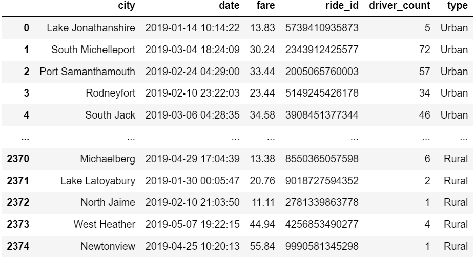
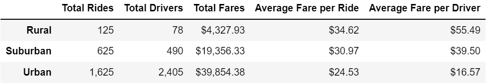
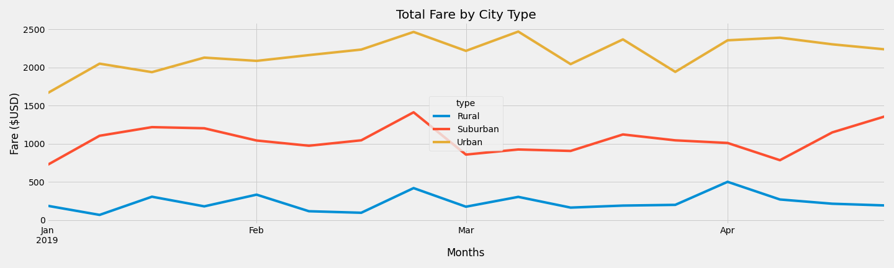

# ChalengeModule_5-PyBer-with-Matplotlib

Module 5 Challenge

## Overview of the Analysis

The purpose of this project is to create a summary DataFrame of the ride-sharing data by city type, then create a multiple-line graph that shows the total weekly fares for each city type.  The results can then be used to see what the data shows for ride shares by city type and how the differences can aid in the decision-making process.  The analysis follows the [Challenge Instructions ]()[Challenge Instructions](Resources/InstructionsChalengeModule_5-PyBer-with-Matplotlib.pdf)  saved in a PDF and used the [Starter Code in PDF file](Resources/StarterCodePDFChalengeModule_5-PyBer-with-Matplotlib.pdf) saved in PDF for reference.  The DataFrame used in the analysis combined data from [city_data.csv](Resources/city_data.csv) and [ride_data.csv](Resources/ride_data.csv).  When an example of the results was shown in either the Challenge Instructions or Starter Code the code used in this analysis was written to mirror the results given.  A DataFrame called pyber_data_df was created merging the csv files above.  Below is a png of DataFrame.  Though the image itself only contains one piece of useful data (2375 rows of data) the DataFrame itself contains useful information used in this analysis.

## Analysis

### Summary of Total Rides, Drivers, Fares, Average Fares per Ride and Average Fare per Driver by City Type

The figure below shows a summary of the Total Rides, Drivers, Fares, Average Fares per Ride and Average Fare per Driver by City Type.  The table png shows that thought the Urban City Type has the most fares it is lowest in Average Fare per Ride and Average Fare per Driver.  The result could be explained by Urban having the lowest Rides per Driver, which is not calculated in the table but calculated as follows: Rural = 1.60 rides per driver; Suburban = 1.28 Rides per Driver; Urban = 0.68 Rides per Driver.

### Summary of Total Fare by City Type Over Time

The Graph below shows the Fare by City Type over Time.  Though the rides by City Type do not correlate exactly to each other there are not extreme peaks and valleys that occur on one city type and not the others.  The variations in the correlation between the number of rides given during a period of time is not able to be explained but the lack of a great variance also excludes the need to research the differences at this moment in time.  Generally speaking, differences in total fares appear to be fairly consistent throughout the time period examined with the exception on an increase in the Suburban type after April that happened while Urban and Rural saw slight decreases.

## Results

•The Urban City Type has the most Revenue, Rides, and Drivers while also having the lowest Average Fare per Ride and Driver.

•The Rural City Type has the Lowest Number of Rides and Drivers and the lowest Average Fare Per Ride and Driver.

•The Suburban City Type places second in all categories.

•The results are stacked ranked as one might assume.

# Summary

Glancing at the numbers presented in this presentation it would be easy to assume that the Urban City Type is the most profitable due to its increase revenue, however without knowing how the profits are driven per ride this could be fallacious.  Without knowing whether shorter or longer rides are more profitable and without knowing the operational costs (both fixed and variable per ride) it would not be possible to use the following information to make profitable decisions.  However, the data does show that a number of drivers in the Urban City type are either not active or cannot deliver more than one ride per period (1625 rides to 2405 drivers.  Conversely, though the Rural City Type offers
more rides per driver and higher average Fares (per Ride and Driver) the data provided does not allow the extrapolation of whether there is room for growth in the Rural market.

## Business recommendations for the CEO are:

•Calculate the number of inactive drivers per City Type.

•Calculate or estimate the number of rides needed (or requested) but not given by City Type.

•Provide data relating to the profitability structure of the rides (are more rides of shorter duration or fewer longer rides more profitable)

Given the recommendations above business decisions could be made to address increasing profitability. Does the company need more active driver for any given city type?  Is it a better course of action to target more customers in Rural, Suburban, or Urban city types (based on which is more profitable).  Should the company try to capture more rides of shorter duration or longer rides.  The information provided and used in this analysis provides half of the equation needed to drive profitability but more information needs to be examined in order to escalate the growth of Pyber.
